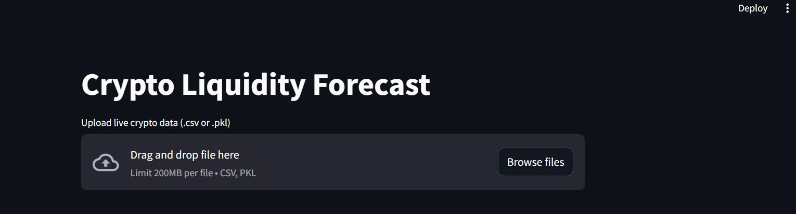
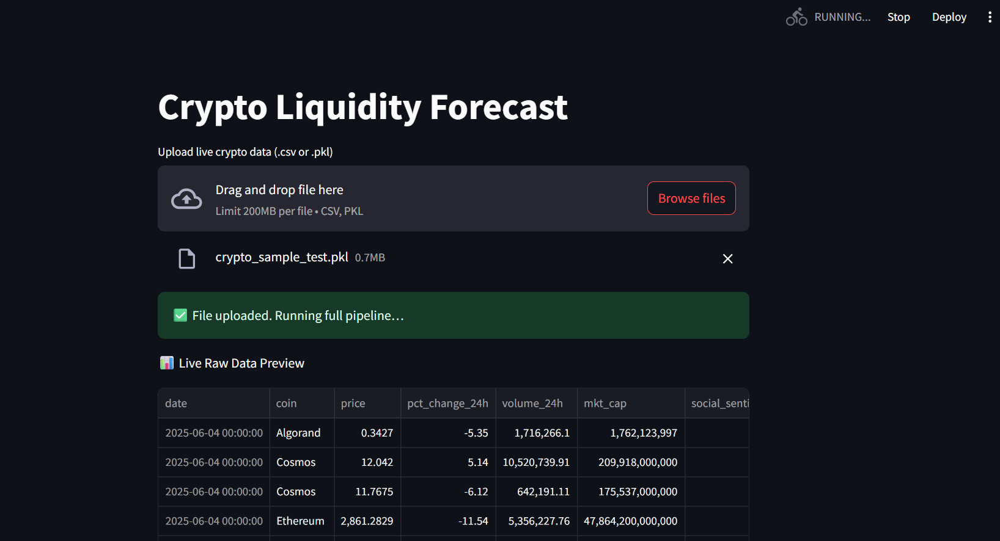
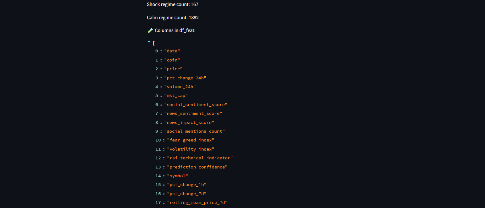
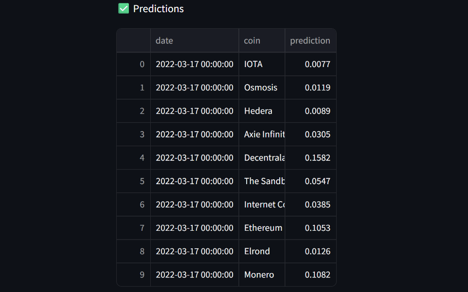
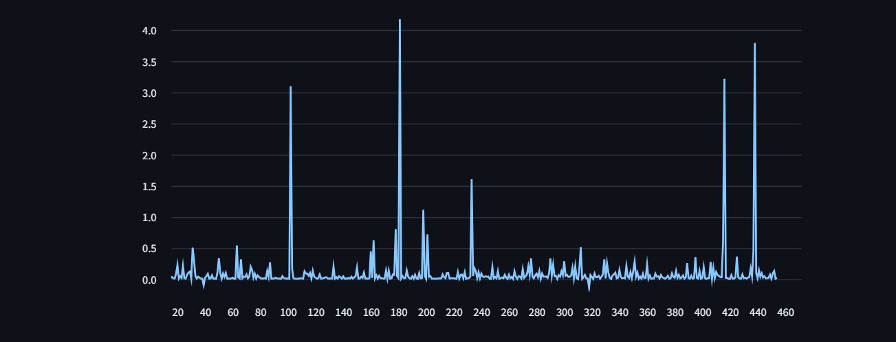
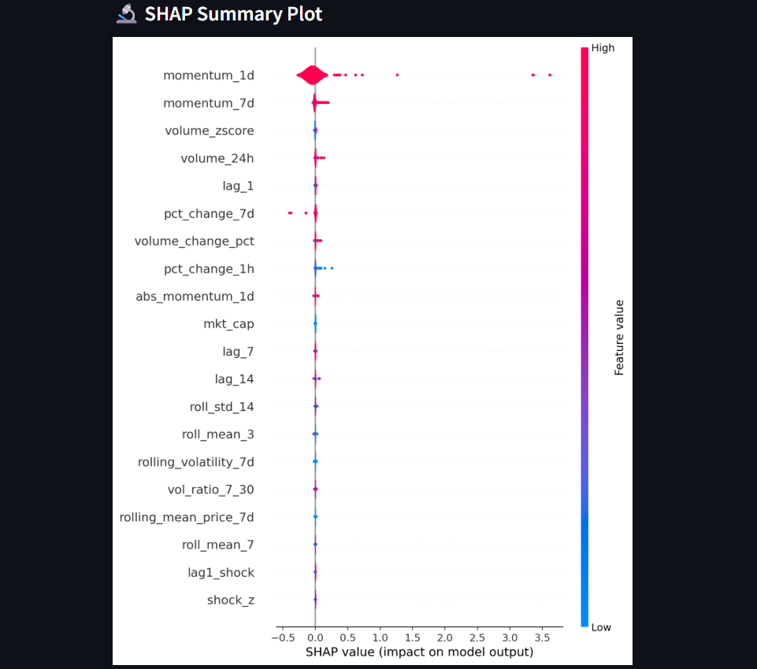
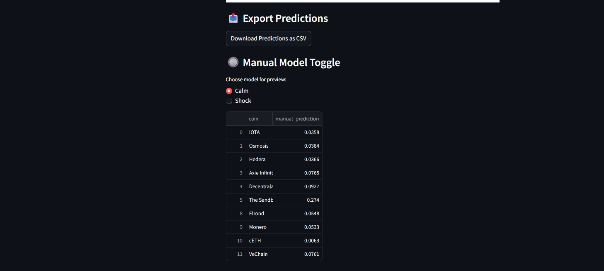

# Handoff Summary: Crypto Forecasting Pipeline - Streamlit App.

This bundle contains a regime-aware ML pipeline for forecasting crypto liquidity. It includes:

- 📊 Trained models for calm and shock regimes
- 🧠 Feature engineering and synthetic augmentation logic
- 🚀 Live prediction script and Streamlit dashboard (`app.py`)
- 📁 Versioned data snapshots and model metadata
- 📦 `requirements.txt` for environment reproducibility

### The Streamlit dashboard supports:

- Live data upload (.pkl)

- Regime-aware routing

- Prediction visualization

- SHAP interpretability

- Exportable results

All components are modular, audit-ready, and extensible for multi-asset support or fallback blending.

Version: `v1.0`  
Author: Shyam Subramani  
Date: 26 Sep 2025