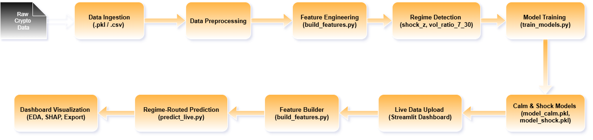
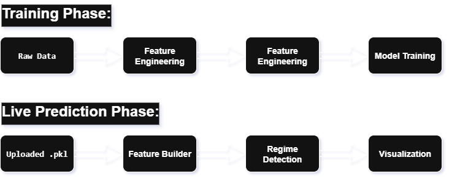

# 🧩 High-Level Design (HLD) Document
## 📌 Project Title: Regime-Aware Crypto Liquidity Forecasting

### 🧠 Objective
Build a robust, modular ML pipeline to forecast crypto liquidity using regime-aware routing, engineered features, and ensemble modeling. The system supports live predictions via a Streamlit dashboard.

### 🧱 System Architecture Overview



### 🧩 Key Components

|Module             |       Description     | 
|-------------------|:------------------:|
| build_features.py |  Constructs regime-aware features, handles SHAP pruning and leak-free logic| 
| train_models.py |Trains calm and shock models using fold-aware validation| 
|predict_live.py | Routes live data through feature builder and prediction ensemble| 
| app.py |Streamlit dashboard for upload, visualization, and export| 
| models/ |Stores trained models and feature column lists| 
| datasets/ | Contains training and live data snapshots| 


### 🔄 Data Flow Summary




🧠 Design Principles
- Modularity: Each component is independently testable and reusable
- Auditability: All transformations are documented and reproducible
- Robustness: Regime-aware routing handles volatility and drift
- Transparency: SHAP plots and feature diagnostics support interpretability
___
___

# 🧩 Low-Level Design (LLD) Document
## 📁 Module: build_features.py
### Purpose:
Transform raw crypto data into regime-aware, leak-free features.
- Key Functions:
```
def build_features(df_raw: pd.DataFrame) -> pd.DataFrame:
    # Applies rolling stats, momentum, volatility ratios
    # Tags regime shocks using z-score thresholds
    # Prunes features using SHAP importance
```
Logic:
- Rolling windows: roll_mean_7, roll_std_7, momentum_1d
- Regime tagging: shock_z > 1.5 → shock regime
- SHAP pruning: Removes low-impact features per model

### 📁 Module: train_models.py
- Purpose:
Train calm and shock models using fold-aware validation.
- Key Functions:
```
def train_model(df_feat: pd.DataFrame, regime: str) -> model:
    # Filters data by regime
    # Applies fold-specific training
    # Saves model and feature list
```
Logic:
- Split by regime_shock
- Use TimeSeriesSplit for validation
- Save model_calm.pkl, model_shock.pkl, feature_cols.pkl

### 📁 Module: predict_live.py
- Purpose:
    - Run live predictions with regime-aware routing.
- Key Functions:
```
def run_live_prediction(df_live: pd.DataFrame) -> pd.DataFrame:
    # Builds features
    # Detects regime
    # Routes to appropriate model
    # Returns full df_feat with predictions
```
- Logic:
    - Load models and feature list
    - Apply build_features()
    - Route: shock_z > 1.5 → model_shock, else model_calm
    - Return df_feat with prediction column

📁 Module: meta/model_meta.json
- Purpose:
    - Stores metadata for audit and reproducibility.
- Contents:
```
{
  "model_version": "v1.0",
  "trained_on": "2025-09-20",
  "features_used": ["price", "volume_24h", "shock_z", ...],
  "regime_threshold": 1.5
}
```

📁 Module: app.py (Streamlit Dashboard)
- Purpose:
    - User interface for uploading data, viewing predictions, and diagnostics.
- Key Blocks:

```
uploaded_file = st.file_uploader(...)
df_live = pickle.load(uploaded_file)
df_pred = run_live_prediction(df_live)
st.dataframe(df_pred[['date', 'coin', 'prediction']])
```
Visualizations:
- Price trends
- Volume boxplots
- Volatility histograms
- SHAP summary plot (TreeExplainer, summary_plot(show=False))
