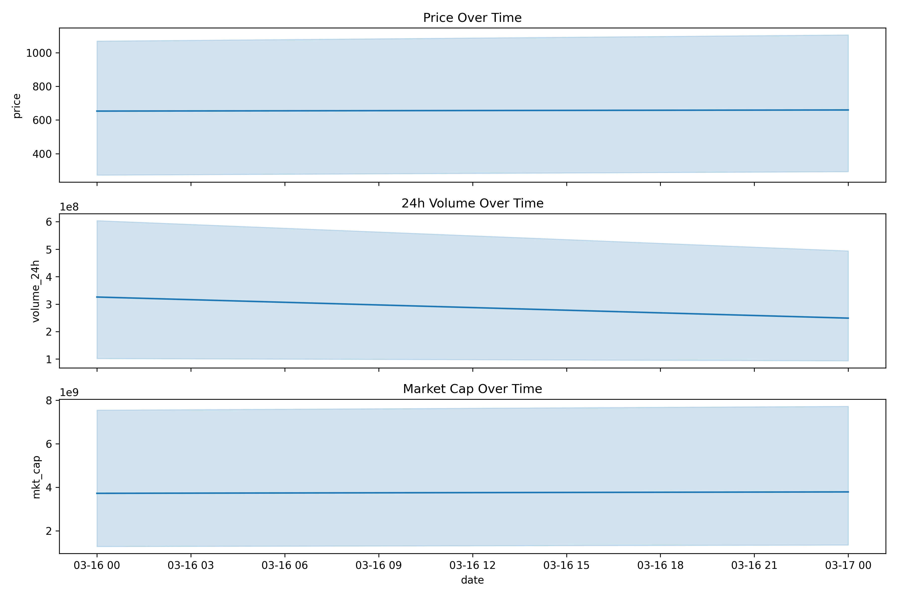
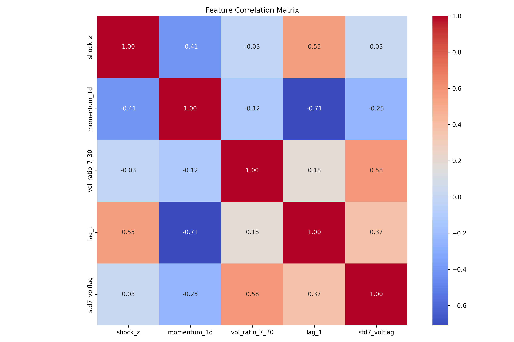
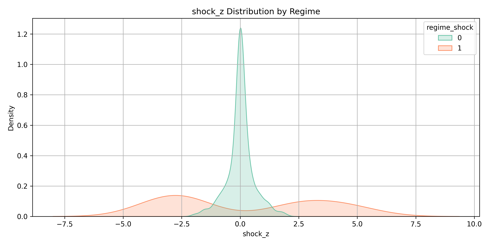
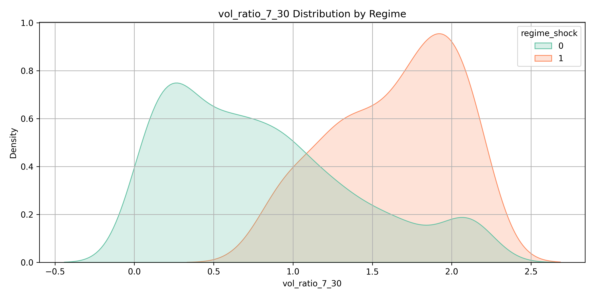
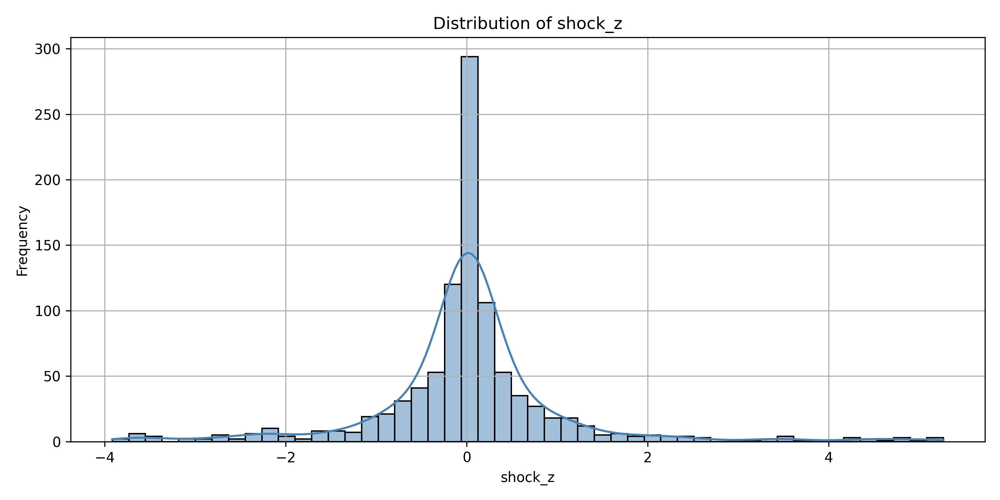
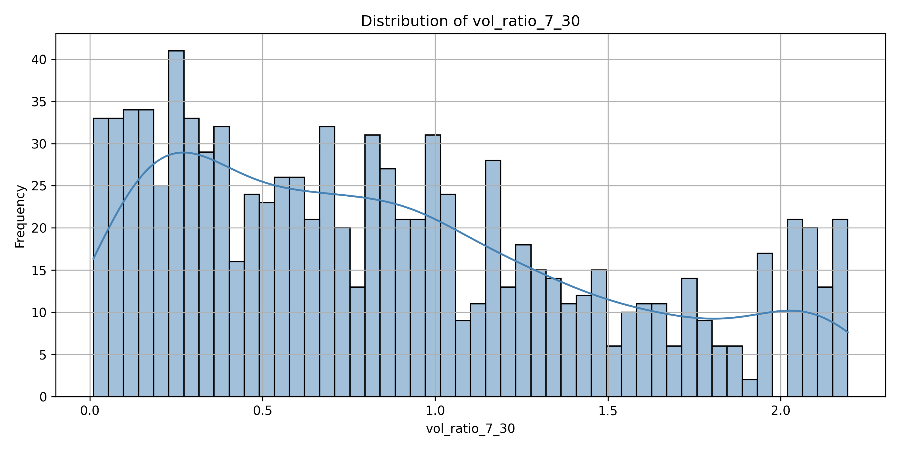
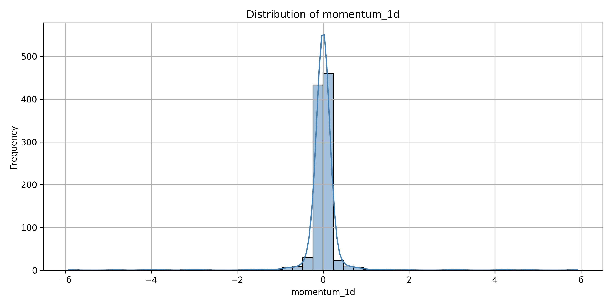

🔍 Dataset Overview
- Source: ```crypto_training_data.pkl```
- Assets: Bitcoin, Ethereum, Solana, etc.
- Time Range: Daily snapshots over several months
- Target: Liquidity ratio (proxy for market depth)

📊 EDA Reports
- Descriptive Statistics
- Summary of price, volume, volatility, and liquidity ratios
- Regime-wise breakdown of key metrics
- Visualizations
- Fold-wise feature drift plots using plot_feature_drift()
- Calm vs shock regime comparisons using plot_regime_split()
- Distribution plots for engineered features (shock_z, momentum_1d, vol_ratio_7_30)
- Optional SHAP overlays for feature importance visualization
- Correlation Analysis
- Feature-target correlation matrix
- Regime-aware correlation shifts (optional)
- Regime Diagnostics
- Count and distribution of regime_shock flags
- Transition patterns between calm and shock regimes
- Volatility clustering and drift detection across folds

### Price_Volume Trends - Time series trends


### Feature-target correlation matrix 


### Momentum Distribution by Regime

### ShockZ Distribution by Regime

### Volume Ratio Distribution by Regime

### Univariate Distribution - ShockZ

### Univariate Distribution - Volume Ratio

### Univariate Distribution - Momentum



Insight:
- shock_z and vol_ratio_7_30 are positively correlated
- momentum_1d inversely correlates with shock_z in volatile regimes

